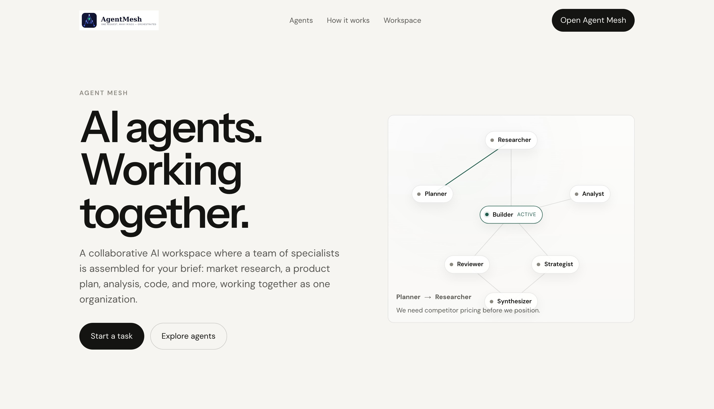
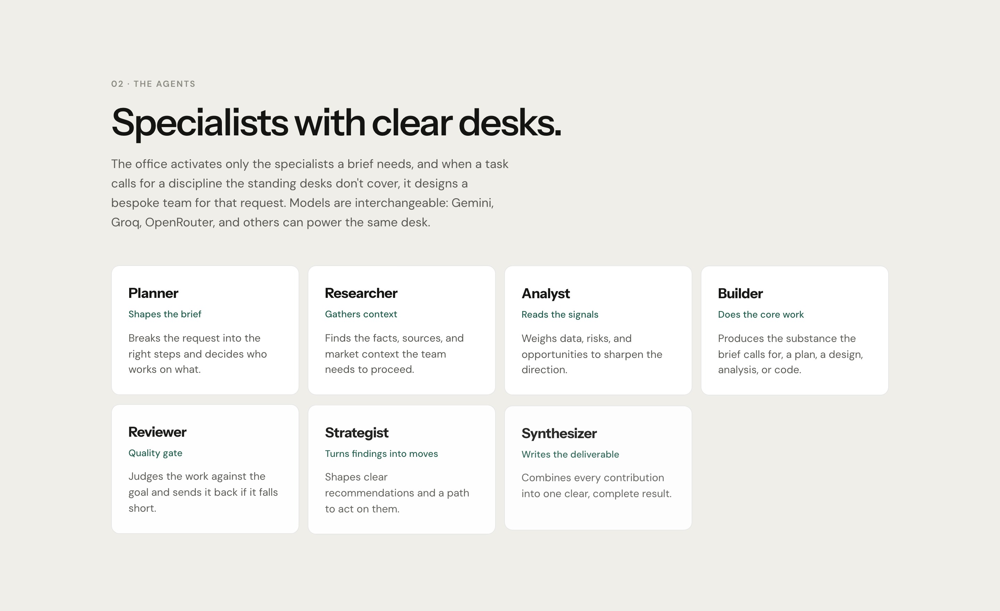
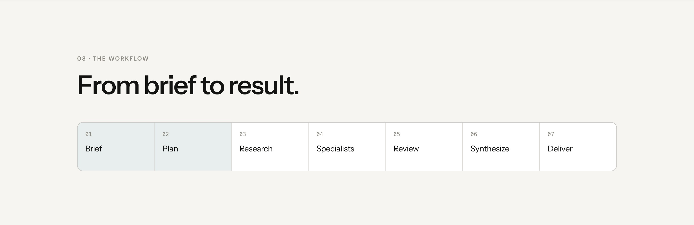
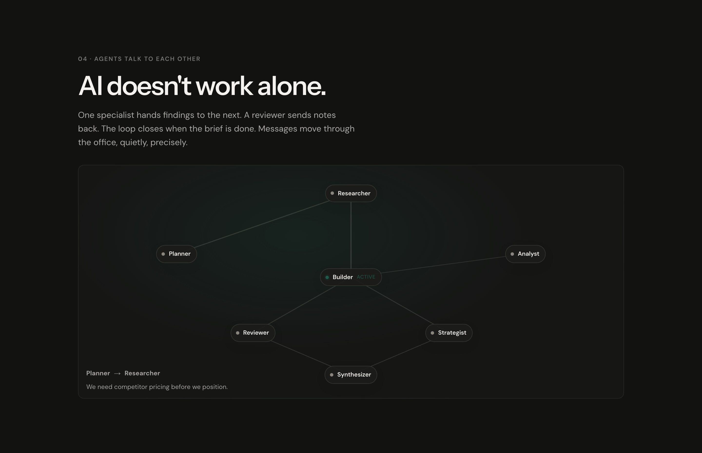
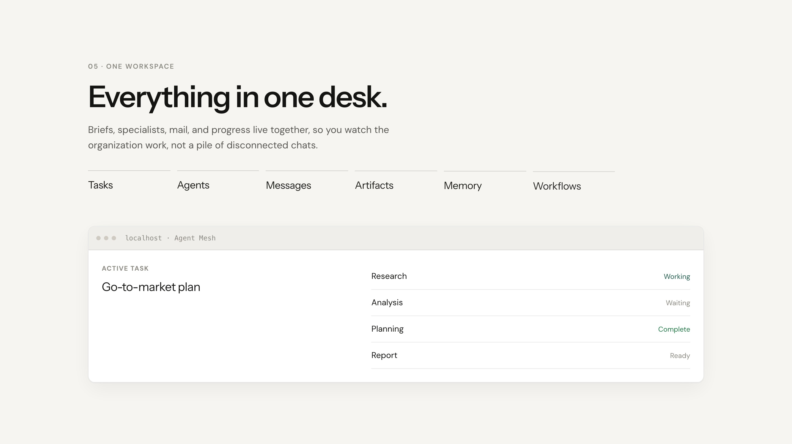
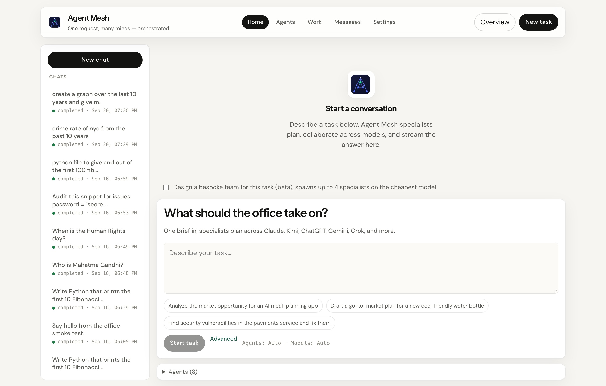
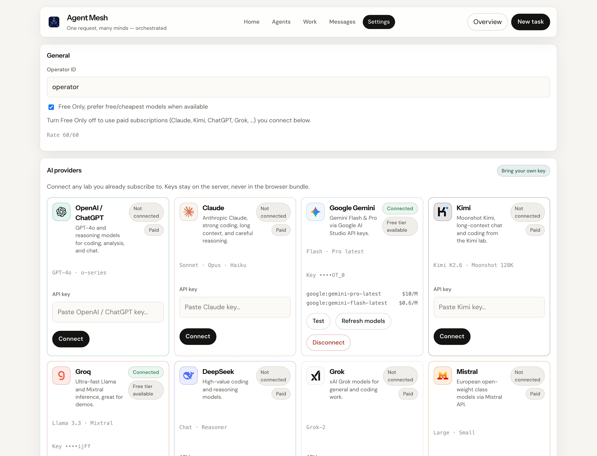

# Agent Mesh

An orchestration engine for specialised AI agents. A user submits one complex request;
the platform determines what work is required, activates **only** the agents whose
capabilities are needed, wires them into a workflow graph (sequential, parallel, or
conditional), routes each agent to an appropriate model provider, validates every
output, and synthesises a single result.

## Screenshots

<p align="center">
  
</p>

<p align="center">
  
</p>

<p align="center">
  
</p>

<p align="center">
  
</p>

<p align="center">
  
</p>

<p align="center">
  
</p>

<p align="center">
  
</p>

It is not a chat interface that sends the same prompt to several models. The product is
the orchestration decision: what to run, what *not* to run, in what order, and on which
model.

> **Status: Sprints 0–8 complete.** Specialised agents are selected by capability,
> planned as a DAG, and executed with skips, retries, approval, and synthesis. They also
> talk directly: durable inboxes, scoped memory, and artifact references. Several
> providers share one routing layer with logged fallback. Cost is visible from the API
> and from Prometheus.
>
> Product shape: an **office of specialists** (brief once; watch desks, mail, and the
> workflow graph) — inspired by multi-agent office harnesses, implemented as a web
> orchestrator rather than a desktop CLI wrapper. See
> [`docs/adr/0006-office-of-specialists.md`](docs/adr/0006-office-of-specialists.md).
>
> Operator identity (`X-Operator-Id`) and workflow ownership shipped in Universal Office
> Sprint 9; rate limits and soft budgets in Sprint 10; production fail-fast in Sprint 11;
> HS256 JWT Bearer validation in Sprint 12; Playwright browser smoke (J-2) in Sprint 13 —
> see ADRs
> [0007](docs/adr/0007-operator-identity.md),
> [0008](docs/adr/0008-rate-limits.md),
> [0009](docs/adr/0009-production-fail-fast.md).

## Run with Docker

Requires Docker with Compose v2+. From the repo root:

```bash
cp .env.example .env
docker compose up --build
```

That starts Postgres, Redis, the API, and the UI.

| URL | What |
|-----|------|
| http://localhost:3000 | Product site (story + agent visualization) |
| http://localhost:3000/office | Workspace — run tasks with the agent roster |
| http://localhost:8000/docs | API docs |
| http://localhost:8000/healthz | Backend health |

Optional provider keys (Claude, Kimi, OpenAI, Gemini, …) go in `.env` — see `.env.example`. Without keys, offline demo mode still works.

Stop with `Ctrl+C`, or run detached with `docker compose up --build -d` and stop with `docker compose down`.

Backend and frontend hot-reload from your working tree. The frontend mounts `app/`, `lib/`, `components/`, and `public/` (not the whole directory), so Next.js generated files stay in the container. `make help` lists other tasks.

## Architecture at a glance

```
Frontend (Next.js)  ->  Backend (FastAPI)  ->  AI providers (external HTTP)
                             |    |
                      PostgreSQL  Redis
                      (durable)   (queues, cache, locks)
```

The backend is a **modular monolith**: orchestrator, agent registry, workflow engine, and
provider adapters are internal modules with enforced dependency direction, not separate
services. PostgreSQL is the only source of truth; Redis holds work we can afford to lose
and rebuild.

Reasoning behind these choices lives in [`docs/adr/`](docs/adr/), and the full picture in
[`docs/architecture.md`](docs/architecture.md).

## Repository layout

```
backend/            FastAPI application
  app/api/          HTTP layer: routes, middleware, dependencies
  app/core/         config, logging, health checks
  tests/            pytest suite
frontend/           Next.js App Router application
docs/
  architecture.md   current architecture
  adr/              architecture decision records
  agile/            vision, backlog, sprint plan, Definition of Done, retrospectives
docker-compose.yml  development stack
Makefile            entry point for every check CI runs
```

## Local development without Docker

Docker is the supported path, but the backend runs directly too:

```bash
make install                              # backend venv + frontend npm ci
cd backend && .venv/bin/uvicorn app.main:app --reload
```

`DATABASE_URL` and `REDIS_URL` default to `localhost`, so a host-based backend needs
Postgres and Redis reachable there — `docker compose up postgres redis` is enough.

## Trying it

With the stack running (`make up`), no API keys needed — a built-in fake provider stands
in so the whole pipeline works offline:

```bash
# See which agents a request would activate, and the most it could cost
curl -s -X POST http://localhost:8000/api/v1/tasks/plan \
  -H 'Content-Type: application/json' \
  -d '{"request":"Find security vulnerabilities in the payments service"}' | python3 -m json.tool

# Run it: analyse, select agents, build a workflow, execute it
curl -s -X POST http://localhost:8000/api/v1/tasks \
  -H 'Content-Type: application/json' \
  -d '{"request":"Analyze this repository for security vulnerabilities, fix the issues, write tests, and document the changes"}' | python3 -m json.tool
```

The narrow request activates one agent and records why the other six were excluded. The
broad one builds a graph such as `planning → security → coding → testing → documentation`,
excluding research and review as irrelevant. Open http://localhost:3000 to submit the
same request and watch node status, skips, cost, and approval gates update live.

Set `OPENAI_API_KEY` (or `ANTHROPIC_API_KEY`, `DEEPSEEK_API_KEY`, `XAI_API_KEY`,
`MISTRAL_API_KEY`, `OPENROUTER_API_KEY`) in `.env` to use a real provider instead of the
fake.

Other endpoints: `GET /api/v1/office`, `GET /api/v1/messages`, `POST /api/v1/messages`,
`GET /api/v1/discovery`, `GET /api/v1/memory`, `GET /api/v1/artifacts`, `GET /api/v1/events`,
`GET /api/v1/metrics`, `GET /api/v1/agents`, `GET /api/v1/capabilities`,
`GET /api/v1/providers`, `GET /api/v1/workflows`, `GET /api/v1/workflows/{id}`,
`POST /api/v1/agents/{id}/run`, `POST /api/v1/workflows/{id}/cancel`,
`POST /api/v1/workflows/{id}/resume`,
`POST /api/v1/workflows/{id}/nodes/{key}/approve|reject|retry|skip`,
and interactive docs at `/docs` outside production. Mutating routes require operator
identity (`X-Operator-Id` or Bearer); workflows are scoped to `owner_id`. Set
`AUTH_MODE=off` only for local scripts that skip the header.

Production images and the secrets-manager path: [`docs/operations/production.md`](docs/operations/production.md).
Grafana: `docker compose --profile observability up` then http://localhost:3001.

## Quality gates

```bash
make check       # lint + typecheck + test, exactly what CI runs
make test        # backend tests only
make lint        # ruff + eslint
make typecheck   # mypy (strict) + tsc
make e2e-ci      # Playwright browser smoke (Demo Mode compose overlay)
```

Backend code is linted with `ruff`, type-checked with `mypy --strict`, and tested with
`pytest`. Frontend uses ESLint and `tsc --noEmit`. CI additionally builds the development
and production images, runs Playwright Chromium smoke against compose (J-2), and scans
the history for committed secrets.

## Configuration and secrets

All configuration comes from environment variables, documented in
[`.env.example`](.env.example). Copy it to `.env`; `.env` is git-ignored and CI fails if
it is ever tracked.

Provider API keys are read **by the backend only**. They are held as secret values that
redact themselves in logs, reprs, and serialised output, and no key or key-derived value
is ever sent to the frontend. Tests never make paid API calls. Production deployments are
intended to source secrets from a secrets manager rather than a `.env` file.

## Contributing

Branches: `main` (releasable), `develop` (integration), and `feature/*`, `bugfix/*`,
`refactor/*` for work. Commits follow Conventional Commits (`feat:`, `fix:`, `test:`,
`docs:`, `chore:`).

Before opening a pull request, run `make check` and walk the
[Definition of Done](docs/agile/definition-of-done.md). Architectural changes need an ADR.

## Troubleshooting

**Backend exits immediately.** It waits for Postgres and Redis health checks; inspect
`docker compose logs backend`. A validation error at startup means a bad value in `.env`
— configuration fails fast on purpose.

**`/readyz` returns 503.** One dependency is unreachable; the response body names which
one and why. Liveness stays 200 in this state by design, since the process itself is fine.

**Port already in use.** Override `BACKEND_PORT`, `FRONTEND_PORT`, `POSTGRES_PORT`, or
`REDIS_PORT` in `.env`.

**Frontend shows "unreachable".** The backend container is still starting or failed;
check `docker compose ps` and the backend logs.

**Stale dependencies after a pull.** `docker compose up --build`. To reset local data
entirely, `make clean`.

**Frontend edits to a new directory are not picked up.** Only `app/`, `lib/`, and
`public/` are mounted. This is deliberate: Next.js takes a file lock on `next-env.d.ts`,
and file locking is unsupported on macOS bind mounts, so mounting the whole directory
kills the dev server with `EDEADLK` (reported as `Unknown system error -35`). Add the new
directory to the `frontend` service's `volumes` in `docker-compose.yml`.
